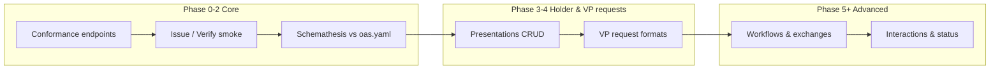

# VCALM test suite — design & implementation analysis

This document interprets [vcalm-normative-stats.json](vcalm-normative-stats.json) and the [normative requirements inventory](normative-requirements.md) for anyone planning or implementing the **vcalm-test-suite**. It is not normative; it explains what the keyword counts imply for interop testing.

**Source spec:** [VCALM 1.0](https://www.w3.org/TR/vcalm-1.0/) (WD 2026-05-05).  
**Counts:** 418 RFC 2119 keyword occurrences across major sections; **357 (85%)** classified as **`http`** (OpenAPI request/response body schema tables).

---

## Executive summary

VCALM is an **HTTP API specification** layered on [VCDM 2.0](https://www.w3.org/TR/vc-data-model-2.0/). The published text is dense with OpenAPI-style schema tables. A naive reading of “418 MUSTs” suggests hundreds of independent tests; in practice:

- Most counts are **schema field constraints** repeated per property and per nested object, not separate protocol behaviors.
- The **real interop surface** for a first suite is much smaller: §1.3 conformance endpoints, a handful of **prose** rules (proof handling, error semantics, interaction URLs), and **JSON shape** checks on a few critical request/response bodies.
- **Workflows (§3.6)** dominate the spec by volume and will dominate **implementation cost** even if early test phases defer them.

Design the suite in **phases** (see [normative-requirements.md](normative-requirements.md)): §1.3 service roles → issuer/verifier happy paths → optional holder/workflow profiles. Tag implementations with `VCALM` only.

---

## What the numbers mean

### Statement types (not all equal)

| Type | Count | Share | What it is |
|------|------:|------:|------------|
| **http** | 357 | 85% | MUST/SHOULD in `Property` / `Response` tables (“It MUST be an object of the following form…”) |
| **conformance** | 19 | 5% | §1.3 — which endpoints each *service role* MUST expose |
| **prose** | 12 | 3% | Narrative protocol rules in §3 (outside schema tables) |
| **config** | 11 | 3% | §2.4 — base URL, authorization, serialization, payload limits |

**Implication:** §3 looks like 369 “requirements” but only **~12 are prose-level protocol rules** in the TR export analyzed. The rest are **JSON Schema–style obligations** embedded in tables. Testing strategy should separate:

1. **Structural conformance** — validate request/response bodies against OpenAPI or JSON Schema (few tests, high coverage).
2. **Behavioral interop** — HTTP status codes, required endpoints, cross-service flows (many tests, targeted).

Counting keywords without this split will over-plan the suite by an order of magnitude.

### Why §3 HTTP API has the most MUSTs

§3 accounts for **369 / 418 (88%)** of all counted statements. Reasons:

1. **OpenAPI rendering in prose** — Each endpoint documents request and response bodies as wide markdown tables. Every nested field (`@context`, `type`, `issuer`, `proof`, `credentialSubject`, …) carries its own MUST, and nested objects multiply counts in a single table row.
2. **Symmetric endpoints** — Issuing, verifying, and presenting all describe full VC/VP graphs in responses. **Verify Presentation (§3.3.2)** and **Participate in Exchange (§3.6.5)** are the largest single subsections because they return the richest structures.
3. **Workflow configuration** — Create/get workflow endpoints describe templates, steps, authorization, and credential templates in one large object tree (**§3.6.1**, **§3.6.2**).

This is **documentation density**, not necessarily **418 distinct obligations**. One table row can contain dozens of keyword hits.

### Why some functional areas rank higher

| Area | Statements | Interpretation |
|------|------------:|----------------|
| **3.6 Workflows** | 154 | Largest area: workflow config, exchange lifecycle, participation payloads, optional protocol delegation. Stateful, multi-request, admin + coordinator + client roles. Highest **suite design** and **fixture** cost. |
| **3.3 Verifying** | 80 | Dominated by **Verify Presentation** response schema (VP + credentials + `verified` + `problemDetails`). Verifier interop is schema-heavy; fewer endpoints than workflows but very wide responses. |
| **3.5 Presenting** | 80 | Spread across derive + create/get/delete presentation; several medium-sized OAS sections. Depends on holder storage and selective disclosure options. |
| **3.2 Issuing** | 33 | Smaller area count but **first-class for interop** — §1.3 requires only `POST /credentials/issue`. Issue Credential still has significant schema (credential + options) but fewer endpoints than workflows. |
| **3.4 VP requests** | 22 | More **data model** for requests (QbE, DID Auth) than HTTP CRUD; some prose. Bridges verifier coordinator ↔ holder. |

**Densest subsections (where “MUST inflation” peaks):**

| Subsection | Total | http | Note |
|------------|------:|-----:|------|
| 3.6.5 Participate in Exchange | 67 | 65 | Exchange step request/response; drives state machine tests |
| 3.3.2 Verify Presentation | 56 | 56 | Entirely schema-table MUSTs |
| 3.6.1 Create Workflow | 45 | 40 | Large configuration object |
| 3.6.2 Get Workflow Configuration | 40 | 40 | Mirrors create response |
| 1.3 Conformance | 19 | 0 | **Real “what must exist”** checklist — start here |

§3.7 Interactions (15, prose) and §3.8 Error handling (4, prose) are small in the count but **disproportionately important** for QR/URL formats and ProblemDetails behavior.

---

## Test suite design challenges

### 1. Keyword count ≠ test count

A single interop test (“issue a credential and assert response shape + HTTP 201”) may satisfy dozens of table MUSTs. Conversely, one table row might need **zero** dedicated tests if covered by OpenAPI validation.

**Recommendation:** Maintain a **test manifest** mapped to spec sections, not to keyword counts. Use stats to find **hot spots**, not as a coverage target.

### 2. Multiple implementation roles per vendor

§1.3 defines **issuer**, **verifier**, **holder**, **workflow**, and **status** services with different required endpoints. Vendors may ship:

- All roles in one deployment
- Only issuer + verifier (common for ACA-Py-style agents)
- Coordinator UIs separately from “services”

The suite must allow **partial profiles** (e.g. `issuer-only`, `verifier+vpVerifier`) via tags or config, while still reporting conformance clearly. Otherwise implementers will skip the suite or fail on irrelevant tests.

### 3. Coordinator vs service endpoints

VCALM describes coordinators (orchestration) and services (HTTP APIs). Interop tests historically hit **service base URLs** (as in the VCDM 2.0 suite). Workflow and exchange tests blur the line: coordinators create exchanges; clients POST to workflow services.

**Challenge:** Tests need stable **BASE_URL** per role, optional **workflow base URL**, and clarity on who initiates each step. Document expected `localConfig.cjs` shape early.

### 4. Out of scope: VCDM / crypto credential validation

VCALM does not redefine VC semantics. **This suite does not run** the VCDM 2.0 or crypto interop suites. Mocha uses minimal fixture credentials to prove API behavior (issue → verify, `verified: true`). Schemathesis checks HTTP shapes against `oas.yaml`. Cryptographic and data-model correctness is left to implementers and to separate suites if they choose to run them.

### 5. Schema validation strategy — [Schemathesis](https://schemathesis.io/)

357 `http`-typed statements beg for **machine validation** against [w3c/vcalm `oas.yaml`](https://github.com/w3c/vcalm/blob/main/oas.yaml), not hand-written Mocha assertions per field. **[Schemathesis](https://schemathesis.io/)** is a practical choice: it is open source, schema-aware, and built for OpenAPI — it generates diverse requests from the schema, validates responses against the same schema, and integrates with CI ([GitHub Action](https://schemathesis.io/), Docker, `uvx`).

**Recommended split:**

| Layer | Tool | Covers |
|-------|------|--------|
| **Structural** | Schemathesis | Request/response shapes, types, required fields, status codes documented in OAS — most `http`-typed MUSTs |
| **Behavioral interop** | Mocha + `vc-test-suite-implementations` | Golden issue/verify paths, §1.3 required endpoints, `verified` / ProblemDetails semantics, proof-set behavior |

Example (against a running implementation):

```bash
# Pin oas.yaml from w3c/vcalm; point at implementer's base URL
export BASE_URL=https://your-vcalm-service.example
uvx schemathesis run https://raw.githubusercontent.com/w3c/vcalm/main/oas.yaml \
  --url "$BASE_URL" \
  --header "Authorization: Bearer $VCALM_TOKEN"
```

**What Schemathesis handles well**

- **Response validation** — flags when live APIs diverge from documented JSON shapes (the bulk of §3.2–3.5 table MUSTs).
- **Input fuzzing** — boundary values, type mismatches, missing required properties on requests.
- **Low maintenance** — new OAS operations pick up tests automatically when `oas.yaml` updates.
- **CI gating** — JUnit XML / exit codes for GitHub Actions alongside the existing interop reporter.

**What still needs the Mocha suite**

- §1.3 **which endpoints must exist** for each role (conformance class), not just shape of calls that happen to succeed.
- **Semantic VC validity** — out of scope for this suite; not a test failure mode here.
- **Prose rules** (~12 in §3): proof sets/chains on issue, 200 + `verified: false`, interaction URL formats (§3.7).
- **Stateful workflows** (§3.6) — use Schemathesis [stateful / linked operations](https://schemathesis.readthedocs.io/) or dedicated multi-step Mocha tests; blind fuzzing alone will not walk exchange state machines reliably.
- **Auth** — configure via `--header` / hooks; OAuth from §2.4 remains implementer-specific.

**VCALM-specific caveats**

1. **Single source of truth** — Treat `oas.yaml` as authoritative for the schema layer; diff TR tables when the spec changes.
2. **Valid request bodies** — Random fuzz inputs often yield 400; combine with **fixed examples** (suite fixtures) via [Schemathesis hooks](https://schemathesis.readthedocs.io/en/stable/extending.html) for happy-path operations.
3. **Partial implementations** — Filter operations (e.g. only `POST /credentials/issue`, `/credentials/verify`, `/presentations/verify`) so issuers are not penalized for missing workflow paths.
4. **Side effects** — `DELETE`, workflow creation, and exchange participation mutate state; use separate CI jobs, read-only profiles, or sandbox tenants.

**Challenge:** OAS may drift from TR tables; run Schemathesis in CI against a **reference implementation** and optionally per-vendor `BASE_URL` from `localConfig.cjs`, publishing results next to the Mocha interop report.

### 6. Stateful workflow and exchange tests

Workflows are inherently **multi-step** (create workflow → create exchange → participate → get state → callbacks). Unlike single-shot issue/verify, they need:

- Shared workflow IDs and exchange IDs across requests
- Time ordering and optional expiration
- Cleanup between tests

**Challenge:** Parallel test runs, shared tenants, and flaky CI if state leaks. Phase 5+ should use isolated workflow instances per test or per run.

### 7. Optional endpoints vs MUST conformance

Many §3 endpoints are MAY for a given role. §1.3 narrows the minimum set. The suite must distinguish:

- **Required for conformance** (fail if missing)
- **Optional profile** (skip or report “not implemented”)

Otherwise issuers without `DELETE /credentials/{id}` fail despite being conformant.

### 8. Authorization and deployment configuration (§2.4)

OAuth2, `read`/`write` scopes, base URL, and content serialization are mostly **MAY** with a few MUSTs. Hard to test in anonymous interop without implementer-supplied credentials.

**Challenge:** Phase 0 should document optional auth headers in config; do not block core issue/verify on OAuth in v1 of the suite.

### 9. Error handling and verification semantics (§3.8)

Prose rules: HTTP 200 can mean “verification ran” with `verified: false`; distinguish errors vs warnings via ProblemDetails. This is **behavioral** and easy to get wrong across implementations.

**Challenge:** Needs curated **negative fixtures** (malformed VP, wrong issuer, expired credential) and assertions on response structure, not just HTTP status.

### 10. Interactions (§3.7) and non-HTTP protocols

Interaction URLs, QR codes, and `interaction:` scheme are **format** requirements with SHOULD-heavy text. Testing may be string/regex based rather than full HTTP round-trips.

**Challenge:** Lower priority for agent interop; higher for wallet/coordinator UIs. Consider a separate tag `VCALM.interactions`.

### 11. Reporting and comparability

W3C interop reporters work well for pass/fail matrices. VCALM’s large surface risks **noisy reports** if every schema field is a separate line item.

**Recommendation:** Group results by phase and endpoint (e.g. “§3.2.1 Issue Credential — response schema”).

---

## Implementation challenges (for implementers & test authors)

### Agents that are not VCALM-native

Many deployments (e.g. ACA-Py, Traction) expose **issuer/verifier** routes that resemble VCALM but differ in paths, bodies, or options. Implementers need an **adapter layer** or the suite needs **vendor-specific endpoint maps** in `localConfig.cjs`.

**Impact:** Phase 1–2 may only include agents with explicit VCALM bindings; broad interop comes later.

### Proof sets, proof chains, and existing proofs

§3.2.1 prose requires configurable handling when `credential` already contains proofs (append, chain, or error). This is **instance configuration**, not visible from a single HTTP call.

**Impact:** Tests should document required issuer configuration or accept multiple valid behaviors with clear reporting.

### Media types and enveloped credentials

Issue Credential allows non-`application/vc` types and `EnvelopedVerifiableCredential`. Test vectors multiply.

**Impact:** Phase 1 uses `application/vc` + Data Integrity only; defer mdoc/SD-JWT/barcode profiles.

### Selective disclosure and mandatory pointers

`options.mandatoryPointers` ties to disclosure schemes. Not all issuers support the same cryptosuites.

**Impact:** Optional test profile; avoid mandatory pointers in baseline vectors.

### Workflows referencing external issuer/verifier services

Workflow configuration can authorize use of external issuer/verifier services. Tests need **multiple BASE_URLs** or a single “playground” deployment that hosts all roles.

**Impact:** Increases CI complexity; consider Docker Compose fixtures for Phase 5.

### Status service (Appendix C)

Optional for many use cases but normatively required for “status service implementation” class.

**Impact:** Phase 8 as optional tag `VCALM.status`; do not conflate with core issuer/verifier interop.

### Flaky network and long-running exchanges

Exchanges can expire; participation may be async with callbacks (§3.6.7).

**Impact:** Generous timeouts in CI; idempotent setup/teardown; avoid hard-coded sleeps.

---

## Suggested testing philosophy



| Priority | Spec focus | Test style | Rationale |
|----------|------------|------------|-----------|
| P0 | §1.3, §3.2.1, §3.3.1–2 | HTTP + golden JSON | Minimum conformant product |
| P1 | §3.2.2–3, §3.3.3, §3.5.1–2 | HTTP + schema | Common holder/issuer paths |
| P2 | §3.8, §3.4 | Negative + ProblemDetails | Cross-cutting correctness |
| P3 | §3.6 | Stateful multi-call | Highest count, highest cost |
| P4 | §3.7, Appendix C | Format / optional profile | Narrower audience |

**Do not** aim for 418 tests. Aim for **tens of well-grouped tests** with schema validation backing the `http`-typed bulk.

---

## How to use the stats going forward

1. Open [vcalm-normative-stats.html](vcalm-normative-stats.html) — charts plus this analysis in one page; compare **HTTP vs prose+** columns per section.
2. When a subsection spike appears (e.g. 3.3.2), ask: **one schema test or many behavioral tests?**
3. Re-run extraction after spec updates:
   ```bash
   SKILL=~/.cursor/skills/spec-analyzer/scripts
   python3 "$SKILL/extract_normative.py" SPEC.md --title "VCALM 1.0" \
     --source "https://www.w3.org/TR/vcalm-1.0/" -o docs/vcalm-normative-stats.json
   python3 "$SKILL/generate_stats_html.py" docs/vcalm-normative-stats.json \
     -o docs/vcalm-normative-stats.html --footer vcalm-test-suite
   ```
4. Keep this analysis aligned when phases or OAS source of truth changes.

---

## Related artifacts

| File | Purpose |
|------|---------|
| [normative-requirements.md](normative-requirements.md) | Section-by-section requirements and phased plan |
| [vcalm-normative-stats.json](vcalm-normative-stats.json) | Machine-readable counts and `by_type` breakdown |
| [vcalm-normative-stats.html](vcalm-normative-stats.html) | Visual dashboard |
